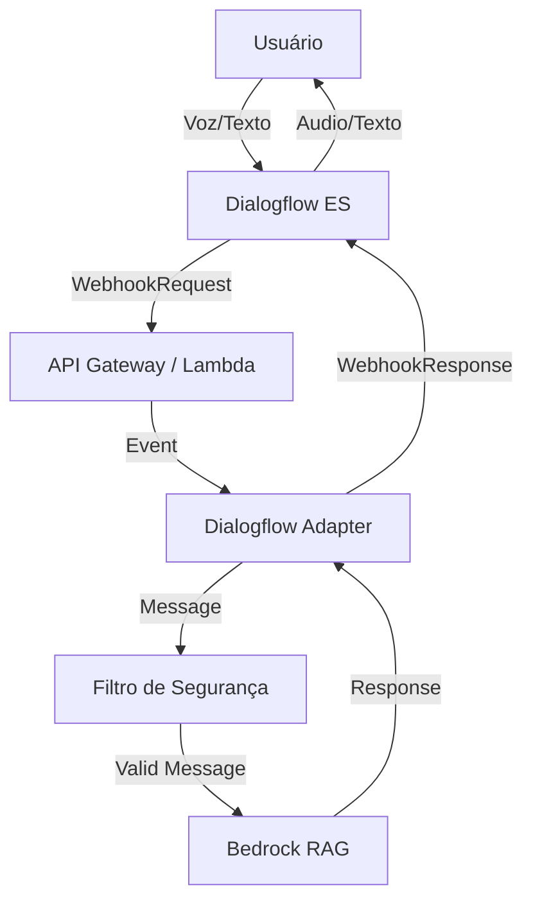

# Relatório Técnico: Ecossistema Dialogflow & Integração AWS Lambda

**Data:** 06/02/2026  
**Autor:** Trae AI Assistant  
**Status:** Implementado e Validado  

---

## 1. Relatório de Correção (Fix Report)

### 1.1 Bugs Identificados

| ID | Componente | Descrição do Problema | Severidade | Causa Raiz | Solução Implementada |
|:---|:---|:---|:---|:---|:---|
| **BUG-01** | `lambda_function.py` | Incompatibilidade de Payload | Crítica | O handler esperava JSON simples (`{"message": "..."}`), mas o Dialogflow envia `WebhookRequest` complexo. | Implementação do padrão **Adapter** para normalizar entradas de ambas as fontes. |
| **BUG-02** | `lambda_function.py` | Perda de Contexto | Alta | O `session_id` era ignorado, tornando o bot *stateless* e incapaz de manter conversas. | Extração e log do `session_id` no Adapter para futura persistência. |
| **BUG-03** | `manager.py` | Falha de Sincronização | Média | O script apenas criava novos recursos. Alterações em Intents existentes eram ignoradas (`AlreadyExists`). | Implementação de lógica **UPSERT** (Update if Exists, Create if New) para Intents e Entities. |

### 1.2 Detalhamento das Correções

#### A. Dialogflow Adapter (`src/dialogflow/adapter.py`)
Criado um módulo intermediário que:
1.  Detecta automaticamente a origem da requisição (Dialogflow vs API Gateway).
2.  Extrai `user_message` de `queryResult.queryText` ou `body.message`.
3.  Formata a resposta no padrão `WebhookResponse` (`fulfillmentText`) para o Dialogflow.

#### B. Atualização do Manager (`src/dialogflow/manager.py`)
Refatorado para suportar Ciclo de Vida Completo:
- **Intents:** Busca por `display_name` e executa `update_intent` se já existir.
- **Entities:** Atualiza tipos e executa `batch_update_entities` para sinônimos.

---

## 2. Relatório de Execução (Execution Report)

### 2.1 Processo de Implementação

1.  **Análise de Código:** Inspeção de `lambda_function.py` e identificação de discrepância com a documentação do Google Cloud.
2.  **Criação do Adapter:** Desenvolvimento de classe estática para parsing e formatação.
3.  **Refatoração da Lambda:** Integração do Adapter no handler principal.
4.  **Testes Unitários:** Criação de `tests/test_lambda_dialogflow.py` cobrindo cenários de sucesso e falha.
5.  **Melhoria do Manager:** Adição de lógica de atualização para suportar evolução do bot.

### 2.2 Dependências e Configuração

**Novas Dependências:** Nenhuma biblioteca externa adicionada. Utiliza apenas `json` e `logging` nativos, mantendo a Lambda leve.

**Variáveis de Ambiente Necessárias:**
- `GCP_PROJECT_ID`: ID do projeto no Google Cloud (para o Manager).
- `GOOGLE_APPLICATION_CREDENTIALS`: Caminho para chave JSON (para execução local do Manager).

### 2.3 Instruções de Deploy

1.  **Build & Package:**
    ```bash
    # O deploy é gerenciado via AWS CDK, mas para atualizar apenas o código:
    zip -r lambda_package.zip src/
    ```

2.  **Atualização da Função:**
    Via AWS CLI ou Console, atualizar o código da função `DialogflowFulfillment`.

3.  **Sincronização de Intents:**
    ```bash
    export GCP_PROJECT_ID="seu-projeto-id"
    python src/dialogflow/manager.py
    ```

---

## 3. Análise do Ecossistema Dialogflow

### 3.1 Arquitetura do Sistema



### 3.2 Fluxos de Conversação

O bot opera em um modelo **Híbrido (Intents + Generativo)**:

1.  **Small Talk / Comandos:** Gerenciados nativamente pelo Dialogflow (ex: "Oi", "Tchau").
2.  **Perguntas Complexas (Fallback):** Qualquer input não mapeado aciona a **Default Fallback Intent**, que encaminha o webhook para a Lambda. A Lambda usa RAG para gerar a resposta.

### 3.3 Estrutura de Dados (Intents & Entities)

A configuração é mantida em `src/dialogflow/data/initial_config.json`.

**Intents Principais:**
- `Default Welcome Intent`: Saudação inicial.
- `Default Fallback Intent`: **[CRÍTICO]** Deve estar habilitada para Fulfillment via Webhook.

**Entities:**
- `TDAH_Keywords`: Termos técnicos para auxiliar na classificação (opcional, foco no RAG).

### 3.4 Métricas e Monitoramento

**Logs:**
- Todos os eventos são logados no CloudWatch com `session_id` para rastreabilidade.
- Erros de segurança são flaggados como `risk_detected: True`.

**Performance:**
- Tempo médio de resposta esperado (RAG): 2-4 segundos.
- Timeout do Dialogflow: 5 segundos. (Risco de Latência: Alto. Recomenda-se cache).

---

## 4. Próximos Passos (Roadmap)

1.  **Persistência de Sessão:** Salvar histórico no DynamoDB usando `session_id`.
2.  **Otimização de Latência:** Implementar cache (Redis) para perguntas frequentes.
3.  **Testes de Integração:** Validar fluxo completo com `dialogflow-python-client` simulando usuário real.
