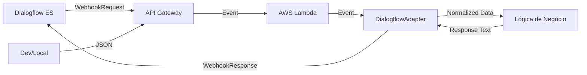

# Documentação da Feature: Dialogflow Ecosystem Fix

**Versão da Documentação:** 1.0.0  
**Versão do Projeto:** v0.2.0  
**Data:** 06/02/2026

---

## 1. Visão Geral

A feature **Dialogflow Ecosystem Fix** foi desenvolvida para resolver incompatibilidades críticas entre a infraestrutura AWS Lambda e o Google Dialogflow ES, além de implementar um gerenciamento robusto de ciclo de vida para os recursos do chatbot (Intents e Entities).

Esta implementação introduz o padrão **Adapter** para normalização de eventos de entrada e saída, permitindo que a função Lambda processe requisições tanto de Webhooks do Dialogflow quanto de eventos diretos do API Gateway (REST) de forma transparente. Adicionalmente, o gerenciador de recursos (`manager.py`) foi refatorado para suportar operações de **UPSERT** (Update or Insert), garantindo sincronização idempotente.

## 2. Objetivos da Implementação

- **Compatibilidade Universal:** Permitir que o mesmo código Lambda atenda chamadas de teste local, API Gateway e Webhooks do Dialogflow sem alterações condicionais complexas no handler principal.
- **Persistência de Contexto:** Garantir a extração e propagação do `session_id` para futuras implementações de memória conversacional.
- **Automação de Ops:** Eliminar falhas manuais na atualização de Intents e Entities, permitindo evolução contínua do bot através de código (Infrastructure as Code).
- **Resiliência:** Tratar erros de "Recurso Existente" (`AlreadyExists`) de forma graciosa, atualizando o recurso em vez de falhar.

## 3. Arquitetura Técnica

### 3.1 Diagrama de Componentes



### 3.2 Componentes Envolvidos

1.  **DialogflowAdapter (`src/dialogflow/adapter.py`)**:
    - **Responsabilidade:** Normalizar payloads de entrada e formatar respostas.
    - **Padrão:** Adapter / Facade.
    - **Entrada:** Detecta automaticamente se o evento é um `WebhookRequest` (Dialogflow) ou um Proxy Event (API Gateway).
    - **Saída:** Gera `WebhookResponse` com `fulfillmentText` ou JSON simples.

2.  **DialogflowManager (`src/dialogflow/manager.py`)**:
    - **Responsabilidade:** Sincronizar configurações locais (`JSON`) com a nuvem (GCP).
    - **Lógica:** Implementa verificação de existência (`list`) antes da criação (`create`) ou atualização (`update`).
    - **Cobertura:** Suporta Intents (frases de treinamento, respostas) e Entities (sinônimos).

3.  **Lambda Handler (`src/lambda_function.py`)**:
    - **Responsabilidade:** Orquestrar o fluxo de processamento.
    - **Integração:** Utiliza o Adapter para extrair `user_message` e `session_id` antes de invocar a lógica de RAG/Bedrock.

## 4. Configuração Necessária

### 4.1 Variáveis de Ambiente (.env)

Para o funcionamento correto dos scripts de gerenciamento e da Lambda:

| Variável                         | Descrição                                         | Exemplo                 |
| :------------------------------- | :------------------------------------------------ | :---------------------- |
| `GCP_PROJECT_ID`                 | ID do projeto no Google Cloud Platform.           | `mvp-tdah-chatbot-123`  |
| `GOOGLE_APPLICATION_CREDENTIALS` | Caminho absoluto para o JSON de chave de serviço. | `/app/credentials.json` |
| `LOG_LEVEL`                      | Nível de detalhe dos logs.                        | `INFO`                  |

### 4.2 Credenciais (Service Account)

É necessário um arquivo JSON de Service Account com as seguintes permissões no IAM do GCP:

- `Dialogflow API Admin` ou
- `Dialogflow Intent Admin` e `Dialogflow Entity Types Admin`

**Nota de Segurança:** Para desenvolvimento local, utilize um arquivo `credentials.json` mockado (falso) se não precisar conectar ao GCP real, ou o arquivo real listado no `.gitignore`.

## 5. Fluxo de Funcionamento

### 5.1 Processamento de Mensagem (Runtime)

1.  **Recebimento:** A Lambda recebe o evento `event`.
2.  **Adaptação:** `DialogflowAdapter.parse_event(event)` é chamado.
    - Verifica se existe `queryResult` (Dialogflow).
    - Se sim, extrai `queryText` e `session`.
    - Se não, tenta extrair `body.message` (API genérica).
3.  **Processamento:** A lógica de negócio processa a mensagem (ex: RAG).
4.  **Resposta:** `DialogflowAdapter.format_response(text, is_dialogflow=True)` cria o JSON de retorno esperado pelo Dialogflow.

### 5.2 Sincronização de Recursos (Deploy Time)

1.  **Leitura:** O script lê `src/dialogflow/data/initial_config.json`.
2.  **Iteração:** Para cada Entity e Intent definida:
3.  **Verificação:** Consulta a API do Dialogflow para checar se o recurso já existe (pelo `display_name`).
4.  **Ação:**
    - **Existe:** Recupera o ID e executa `update_intent` / `update_entity_type`.
    - **Não Existe:** Executa `create_intent` / `create_entity_type`.

## 6. Exemplos de Código

### 6.1 Uso do Adapter na Lambda

```python
from src.dialogflow.adapter import DialogflowAdapter

def lambda_handler(event, context):
    # 1. Normalização
    user_message, session_id, params = DialogflowAdapter.parse_event(event)

    # 2. Lógica de Negócio
    response_text = f"Processado para sessão {session_id}: {user_message}"

    # 3. Formatação da Resposta
    is_webhook = "queryResult" in event.get("body", {}) or "queryResult" in event
    return DialogflowAdapter.format_response(response_text, is_dialogflow=is_webhook)
```

### 6.2 Estrutura do JSON de Configuração

```json
{
  "intents": [
    {
      "display_name": "Agendar Consulta",
      "training_phrases": ["Quero marcar", "Agendar médico"],
      "messages": [{ "text": "Para qual dia você gostaria?" }]
    }
  ]
}
```

## 7. Instruções de Instalação e Execução

### 7.1 Instalação de Dependências

```bash
pip install -r requirements.txt
# Certifique-se de que google-cloud-dialogflow está instalado
```

### 7.2 Executando a Sincronização (Manager)

```bash
# 1. Configure as credenciais
export GCP_PROJECT_ID="seu-projeto-id"
export GOOGLE_APPLICATION_CREDENTIALS="/path/to/credentials.json"

# 2. Execute o script
python src/dialogflow/manager.py
```

### 7.3 Executando Testes

```bash
pytest tests/test_dialogflow.py
```

## 8. Troubleshooting e Problemas Conhecidos

### 8.1 Erro: "AlreadyExists"

**Causa:** Tentativa de criar um recurso que já existe sem usar a lógica de update.
**Solução:** Certifique-se de estar usando a versão `v0.2.0` ou superior do `manager.py`, que implementa o tratamento de exceção e fallback para update.

### 8.2 Erro: "AttributeError: EntitiesBatch"

**Causa:** Uso de classes internas descontinuadas da biblioteca `google-cloud-dialogflow`.
**Solução:** O código foi corrigido para passar listas de dicionários ou objetos `Entity` diretamente para `batch_update_entities`.

### 8.3 Latência

**Limitação:** A verificação de existência (`list_intents`) adiciona uma chamada de rede extra antes de cada operação de escrita.
**Mitigação:** Para cargas massivas, implemente um cache local dos IDs de intents no início do script.

## 9. Versionamento

Esta funcionalidade foi introduzida na versão **v0.2.0**.
Consulte o `CHANGELOG.md` para histórico detalhado de alterações.

---

**Referências:**

- [Google Cloud Dialogflow ES Client Library](https://cloud.google.com/python/docs/reference/dialogflow/latest)
- [Dialogflow Webhook Request/Response Format](https://cloud.google.com/dialogflow/es/docs/fulfillment-webhook#webhook_request)
